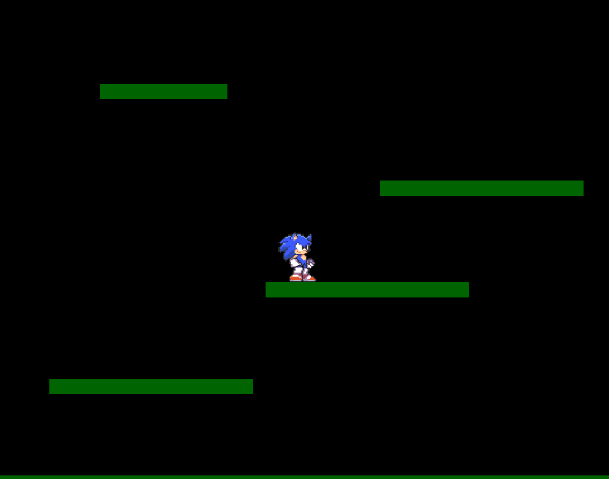

# Sonic platforms

This was going to be a game however I chose not to finish it.

Sonic can run around and jump on the platforms.

I implemented Coyote time, jump buffering and the jump action works well.

It is written using SDL2 and you will need to have the SDL2 development libraries installed to run this.

This would be useful for looking at as an example of how to get started in SDL2.



## Getting Started

The game comes with a makefile. Simply type make when in the directory and it will compile.
  
## Prerequisites

If you don't have the SDL2 libraries installed then the below should work.

```
sudo apt-get install libsdl2-dev
```

## Author

* **hatchet-elf** 
* **https://github.com/hatchet-elf/Sonic platforms** 


## License

This project is licensed under the MIT License - see the [LICENSE] file for details


